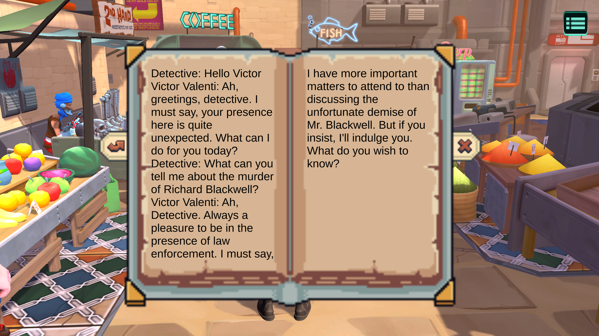

# Artificial Investigator
#### A game by Jasfiq Rahman
*Assignment 01 of 3D Games Programming | MSc Game Development (Programming) | Kingston University*

## Introduction

Welcome to my project! This endeavor represents my exploration of utilizing AI generation tools to craft a seamless and engaging game experience. The project is released under the MIT license, granting you the freedom to repurpose it as you see fit (a little credit would be appreciated, as it goes a long way in supporting my work).

### Project Overview
For a brief overview of the project, check out the [YouTube video](https://www.youtube.com/watch?v=DfHRpODMfmU) where I delve into its key aspects. This video provides insights into the project's goals, development process, and some exciting highlights.

For your convenience, a build of the project is available for download on my [itch.io](https://jasfreaq.itch.io/artificial-investigator) page. Simply follow the project setup steps outlined above for OpenAI authentication to get started.

### Explore My Portfolio
If you're interested in learning more about who I am and the range of projects I work on, feel free to explore my [portfolio](https://jasfiq-rahman.com/). There, you'll find additional details about my background, skills, and a showcase of other projects I've undertaken.

Feel free to dive in, repurpose, and explore the possibilities that this project offers. Your curiosity and creativity are always encouraged!

## Content
- [Project Setup](#project-setup)
- [Problem Statement](#problem-statement)
- [Plot and Characters](#plot-and-characters)
- [SerializableObjects for Modular Plots](#serializableobjects-for-modular-plots)
- [Prompt Engineering for Personality](#prompt-engineering-for-personality)
- [Major Classes](#major-classes)
- [Vector Search for Optimization](#vector-search-for-optimization)
- [Timeout Feature to Avoid Delays](#timeout-feature-to-avoid-delays)
- [Notebook UI for Conversation History](#notebook-ui-for-conversation-history)
- [Potential Improvements](#potential-improvements)
- [AI Generation Tools Used](#ai-generation-tools-used)
- [References](#references)
- [Assets Used](#assets-used)

## Project Setup
To utilize, you'll need to provide OpenAI authentication information. To access the necessary API key and organization ID, please refer to your OpenAI developer account. If you haven't set up an OpenAI developer account yet, it's recommended to do so. Once you have your OpenAI developer account ready, follow these steps:

1. Navigate to `Users/[current user]`.
2. Create a new text file named `.openai` (with no extensions).
3. Edit the file and add the following JSON format:

```json
{
  "apiKey": "sk-aaaabbbbbccccddddd",
  "organization": "org-yourOrganizationId"
}
```
For detailed guidance on utilizing OpenAI APIs in your development process, consult the documentation provided under the RageAgainstThePixel Wrapper in the [Assets Used](#assets-used) section.


## Problem Statement
This project was inspired by a 2017 video from Game Maker's Toolkit, which highlighted the design issues in detective games. One of the core problems identified by Mark Brown was that players often rely on predefined dialogue options to find solutions, leading to a lack of true player agency and independent thinking.

In his words, "They (the player) are not coming up with their own thoughts so much as simply looking at the answer that sounds most sensible. Or in some cases, just guessing.”<sup>[[1]](#references)</sup>

This project aims to address this problem by utilizing OpenAI's conversational technology. It seeks to create a narrative structure that avoids giving players clues through dialogue prompts, promoting an open-ended approach where players must ask the relevant questions to uncover answers.

## Plot and Characters
The project's narrative unfolds within a captivating futuristic cyberpunk backdrop, introducing players to a high-stakes challenge. The CEO of a prominent tech corporation has met an untimely demise, and players step into the role of a detective tasked with unearthing the enigma behind this murder.

To aid and hinder the player's progress are the following NPCs:

- **The Detective's Assistant:** Offers crucial support, providing guidance, research assistance, and valuable insights to navigate the intricate case.

- **The Local Crime Lord:** A complex adversary with intricate connections that can help or hinder the detective's progress.

- **The Crime Lord's Enforcer:** The muscle behind the local crime lord's operations, adding a menacing element to the storyline.

- **The Intern at the Tech Company:** May yield valuable insights into the CEO's murder, potentially leading to critical breakthroughs in the investigation.

- **The CEO's Personal AI:** Adds a technological twist, potentially holding vital information and assisting the player with its unique capabilities.

- **The Social Media Influencer:** Embodies the cyberpunk society's social media savvy and may disseminate information, rumors, or assist in the investigation through their online presence.

## SerializableObjects for Modular Plots
The project's narrative elements, including the plot, setting, and character attributes, are encapsulated using `SerializableObjects`. This modular design approach enables the effortless generation of multiple narratives by substituting pertinent objects, all without the need to alter the code that interfaces with OpenAI.

Key classes within this system include:

- **WorldContextInfo:** This object serves as the repository for game world context, housing vital plot and setting information.

- **CharacterInfo:** Responsible for preserving character personality traits and a list of essential goals for the player-character interactions.

- **GoalInfo:** This object manages goal-related data, including a unique identifier and a list of prerequisite goals that must be fulfilled before engagement.

## Prompt Engineering for Personality
This project's core challenge was imbuing NPCs with distinct personalities and ensuring meaningful player-NPC interactions while maintaining narrative coherence. To tackle this, I employed a structured approach aligned with GPT best practices.<sup>[[2]](#references)</sup>

The system message structure included:

- **Primary instructions:** Guiding AI to embody specific characters in line with the plot.
- **Plot context:** Ensuring AI responses align with the overarching storyline.
- **Setting context:** Providing environmental details for contextually rich responses.
- **Character context:** Enabling AI to deliver authentic, character-consistent dialogues.

Subsequent to the system message, the conversation history of the presently engaged NPC was presented, succeeded by a user message specifying the NPC's current objective, and concluding with the freshly input prompt.

## Major Classes

The primary classes in my project that interface with OpenAI are as follows:

- **NpcPrompter:** This class manages the conversation history and facilitates the transmission of inputs to the `GptIntegrator`.

- **GptIntegrator:** Responsible for structuring prompts and communicating with OpenAI, this class also monitors OpenAI Rate Limits.

- **SystemGoalsManager:** This class tracks cleared goals and keeps them up-to-date.

- **NpcGoalsHandler:** In charge of storing NPC goals and updating them based on responses from the `SystemGoalsManager`.

- **GoalEventsHandler:** This class triggers events based on completed goals.

## Vector Search for Optimization
In cases where the processing limits defined by OpenAI were exceeded, a vector search<sup>[[3]](#references)</sup> was employed to segment the conversation history into manageable chunks. This approach involved a straightforward in-memory scan to extract the relevant conversation chunks. The implementation of this strategy was the responsibility of the following key classes:

- **IVectorObject:** An interface that defined the behavior of vector objects.

- **VectorCollection:** A versatile collection type used for storing conversation chunks and implementing efficient vector searches.

- **VectorMath:** A static library that contained functions essential for vector searches, as utilized by `VectorCollection`.

- **DialogueChunk:** A specialized object dedicated to storing prompts, responses, and their associated vector embeddings obtained through OpenAI's embedding APIs.

- **NpcPrompter:** This class played a pivotal role in obtaining chunk vectors via OpenAI and then storing them within a `VectorCollection` for later reference.

## Timeout Feature to Avoid Delays
To address potential extended wait times arising from OpenAI's API calls, a timeout feature has been successfully incorporated into both the `GptIntegrator` and `SystemGoalsManager` components. This addition ensures a smoother and more responsive user experience. The structure of the timeout feature is outlined as follows:


## Notebook UI for Conversation History
A notebook-based UI was introduced to enable users to review the conversation history with various NPCs. This choice of a notebook was due to the futuristic cyberpunk backdrop of the game. It lends an extra layer of character to the detective by reinforcing the idea of the detective's meticulous nature.

In a hyper-advanced society, where cybersecurity is a constant concern, the use of a physical notebook to keep track of information emphasizes the detective's careful and security-conscious approach, as opposed to relying on potentially vulnerable electronic devices.



## Potential Improvements
1. **Emotional Response Integration:**
   Enhance the player experience by implementing a system that gauges the AI's response mood and synchronizes relevant character animations to convey emotions effectively.

2. **Assistant AI for Player Guidance:**
   Consider the incorporation of an assistant AI to offer subtle hints and guidance to players when they encounter challenges or pursue incorrect lines of deduction. This addition can contribute to a smoother and more engaging gameplay experience.

3. **Flexible Goal Management with a Director AI:**
   Implement a director AI to enhance the flexibility of NPC goal management. This dynamic system can adapt, improve, and adjust NPC goals to create a more fluid and responsive narrative, further enriching the player's interaction with the game.

## AI Generation Tools Used
- **[ChatGPT](https://chat.openai.com/):** Used for ideation and debugging.

- **[Stable Diffusion](https://stablediffusionweb.com/):** Utilized for generating the Title Screen image.

- **[Ready Player Me](https://readyplayer.me/):** Employed for creating character models.

- **[MyEdit](https://myedit.online/en/audio-editor/ai-sound-effect-generator):** Used for incorporating sound effects.

- **[Splash Music](https://pro.splashmusic.com/):** Utilized for background music.

## References
[1] Game Maker's Toolkit, "What Makes a Good Detective Game?" 2017. [Online video]. Available: [Game Maker's Toolkit Video](https://www.youtube.com/watch?v=gwV_mA2cv_0&t=227s).

[2] OpenAI, "GPT Best Practices." OpenAI Documentation. [Online article]. Available: [OpenAI Documentation - GPT Best Practices](https://platform.openai.com/docs/guides/prompt-engineering). Accessed: November 1, 2023.

[3] Alexander Bartz, “Vector Search with C#: A Practical Approach for Small Datasets,” 2023. [Online article]. Available: [Vector Search Article](https://crispycode.net/vector-search-with-c-a-practical-approach-for-small-datasets/). Accessed: November 1, 2023.

## Assets Used
- [RageAgainstThePixel's OpenAI Wrapper for Unity](https://github.com/RageAgainstThePixel/com.openai.unity)
- [Pixelbooks](https://foxeldev.itch.io/pixelbooks)
- [Holoui](https://wenrexa.itch.io/holoui)
- [Sci-Fi Game UI Collection (Free Version)](https://sungraphica.itch.io/sci-fi-game-ui-collection-free-version)
- [Adventure Sample Game](https://assetstore.unity.com/packages/templates/tutorials/adventure-sample-game-76216)
- [Robot Kyle URP](https://assetstore.unity.com/packages/3d/characters/robots/robot-kyle-urp-4696)