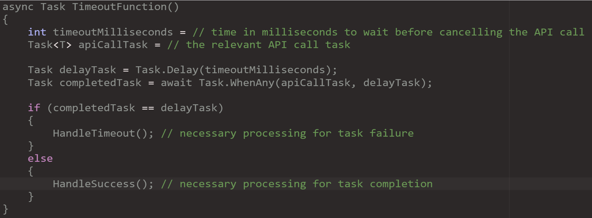

# Artificial Investigator
### A game by Jasfiq Rahman
*Assignment 01 of 3D Games Programming | MSc Game Development (Programming) | Kingston University*

## Problem Statement
This project was inspired by a 2017 video from Game Maker's Toolkit, which highlighted the design issues in detective games. One of the core problems identified by Mark Brown was that players often rely on predefined dialogue options to find solutions, leading to a lack of true player agency and independent thinking.

In his words, "They (the player) are not coming up with their own thoughts so much as simply looking at the answer that sounds most sensible. Or in some cases, just guessing.”

This project aims to address this problem by utilizing OpenAI's conversational technology. It seeks to create a narrative structure that avoids giving players clues through dialogue prompts, promoting an open-ended approach where players must ask the relevant questions to uncover answers.

## Plot and Characters
The project's narrative unfolds within a captivating futuristic cyberpunk backdrop, introducing players to a high-stakes challenge. The CEO of a prominent tech corporation has met an untimely demise, and players step into the role of a detective tasked with unearthing the enigma behind this murder.

To aid and hinder the player's progress are the following NPCs:

- **The Detective's Assistant:** Offers crucial support, providing guidance, research assistance, and valuable insights to navigate the intricate case.

- **The Local Crime Lord:** A complex adversary with intricate connections that can help or hinder the detective's progress.

- **The Crime Lord's Enforcer:** The muscle behind the local crime lord's operations, adding a menacing element to the storyline.

- **The Intern at the Tech Company:** May yield valuable insights into the CEO's murder, potentially leading to critical breakthroughs in the investigation.

- **The CEO's Personal AI:** Adds a technological twist, potentially holding vital information and assisting the player with its unique capabilities.

- **The Social Media Influencer:** Embodies the cyberpunk society's social media savvy and may disseminate information, rumors, or assist in the investigation through their online presence.

## SerializableObjects for Modular Plots
The project's narrative elements, including the plot, setting, and character attributes, are encapsulated using `SerializableObjects`. This modular design approach enables the effortless generation of multiple narratives by substituting pertinent objects, all without the need to alter the code that interfaces with OpenAI.

Key classes within this system include:

- **WorldContextInfo:** This object serves as the repository for game world context, housing vital plot and setting information.

- **CharacterInfo:** Responsible for preserving character personality traits and a list of essential goals for the player-character interactions.

- **GoalInfo:** This object manages goal-related data, including a unique identifier and a list of prerequisite goals that must be fulfilled before engagement.

## Prompt Engineering for Personality
This project's core challenge was imbuing NPCs with distinct personalities and ensuring meaningful player-NPC interactions while maintaining narrative coherence. To tackle this, I employed a structured approach aligned with GPT best practices.[2]

The system message structure included:

- **Primary instructions:** Guiding AI to embody specific characters in line with the plot.
- **Plot context:** Ensuring AI responses align with the overarching storyline.
- **Setting context:** Providing environmental details for contextually rich responses.
- **Character context:** Enabling AI to deliver authentic, character-consistent dialogues.

Subsequent to the system message, the conversation history of the presently engaged NPC was presented, succeeded by a user message specifying the NPC's current objective, and concluding with the freshly input prompt.

## Major Classes

The primary classes in my project that interface with OpenAI are as follows:

- **NpcPrompter:** This class manages the conversation history and facilitates the transmission of inputs to the `GptIntegrator`.

- **GptIntegrator:** Responsible for structuring prompts and communicating with OpenAI, this class also monitors OpenAI Rate Limits.

- **SystemGoalsManager:** This class tracks cleared goals and keeps them up-to-date.

- **NpcGoalsHandler:** In charge of storing NPC goals and updating them based on responses from the `SystemGoalsManager`.

- **GoalEventsHandler:** This class triggers events based on completed goals.

## Vector Search for Optimization
In cases where the processing limits defined by OpenAI were exceeded, a vector search was employed to segment the conversation history into manageable chunks. This approach involved a straightforward in-memory scan to extract the relevant conversation chunks. The implementation of this strategy was the responsibility of the following key classes:

- **IVectorObject:** An interface that defined the behavior of vector objects.

- **VectorCollection:** A versatile collection type used for storing conversation chunks and implementing efficient vector searches.

- **VectorMath:** A static library that contained functions essential for vector searches, as utilized by `VectorCollection`.

- **DialogueChunk:** A specialized object dedicated to storing prompts, responses, and their associated vector embeddings obtained through OpenAI's embedding APIs.

- **NpcPrompter:** This class played a pivotal role in obtaining chunk vectors via OpenAI and then storing them within a `VectorCollection` for later reference.

## Timeout Feature to Avoid Delays
To address potential extended wait times arising from OpenAI's API calls, a timeout feature has been successfully incorporated into both the `GptIntegrator` and `SystemGoalsManager` components. This addition ensures a smoother and more responsive user experience. The structure of the timeout feature is outlined as follows:

